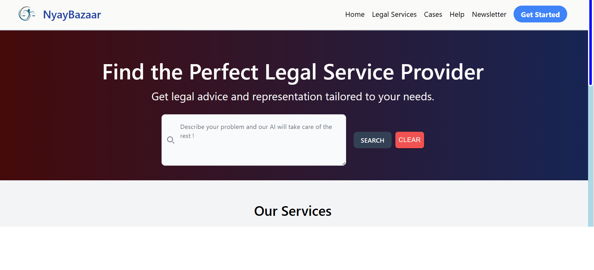

# NyayBazaar - Transforming Legal Services

## SIH Team Vikram

### Project Proposal

Welcome to the NyayBazaar GitHub repository! NyayBazaar is our proposed solution for transforming the legal service sector in India. We aim to connect citizens with the right legal service providers, making legal services accessible, transparent, and affordable for all.

## Key Features and Components

### 1. Accessibility and Affordability
- Raise awareness about government schemes.
- Integrate with DigiLocker and government platforms.
- Offer native language support.
- Provide an intuitive user-friendly design.
- Feature a detailed FAQ section.
- Generate sharable QR codes for easy access.

### 2. Legal Education and Awareness
- Dedicated FAQ and General Knowledge sections.
- Access to legal education materials.
- Enhance understanding of legal matters.

### 3. Tag-Based Smart Filtering for Legal Queries
- Smart filters and tag system for lawyer search.
- Filter based on price, rating, recommendation, experience, locality, and language.

### 4. Comprehensive Lawyer Profiles
- Lawyer profiles with certificate verification.
- Easily shareable QR codes and links for quick access.

### 5. Multi-Channel Communication
- Video, audio, and text-based chat systems.
- Connect clients with legal service providers.

### 6. AI-Powered Legal Assistant and Query Matching
- AI legal advisor using Large Language Models (LLMs).
- Guidance on legal queries.
- Recommendations for appropriate legal actions and lawyers.

### 7. Monthly Lawyer Newsletters
- Lawyers contribute articles to a monthly newsletter.
- Featured on the homepage to educate citizens on legal matters.
- Promote participating lawyers.

### 8. Case Tracking and Lawyer Availability Alerts
- Lawyers set availability status.
- Clients receive alerts when preferred lawyers become available.
- Acknowledgment of requests and regular case updates.

### 9. Quality Assurance through Client Feedback, Reviews, and Ratings
- Verification of lawyers' official certifications using DigiLocker.
- Robust ratings, reviews, and feedback mechanisms by certified clients.
- Endorsements by top verified lawyers.

### 10. Security Using Blockchain
- Store sensitive case-related material using blockchain technology.

### 11. Secure Payments
- Provide a secure payment gateway.
- Ensure timely payments with payment alerts.
- Allow lawyers to set payment cycles and track them.

### 12. Lawyer Incentives
- Incentivize lawyers with bonuses and recommendations.
- Maintain high ratings and engage in pro-bono work.

### 13. Verification and Accountability
- Verify official certificates of lawyers using DigiLocker.
- Ensure transparency and accountability through case tracking for clients.

## Team Members
- [Jash Shah](https://www.github.com/Jash-Shah) 
- [Toshan Luktuke](https://www.github.com/toshan-luktuke)
- [Sarrah Bastawala](https://www.github.com/sarrah-basta)
- [Akshay Phalke](https://www.github.com/asphalke07)
- [Vaibhav Patel](https://www.github.com/noobCoderVP)
- [Himanshu Choghule](https://www.github.com/himanshu-02)
